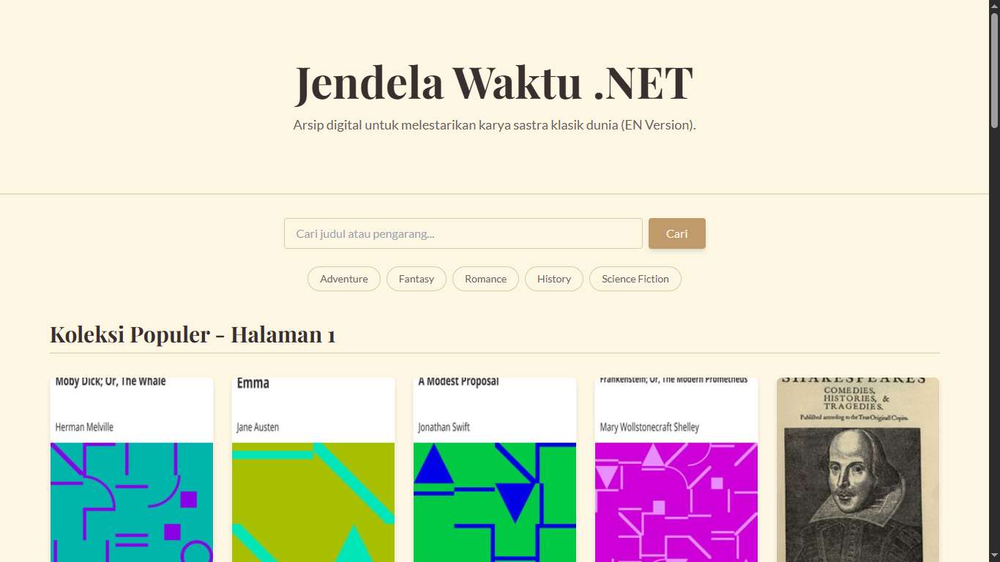
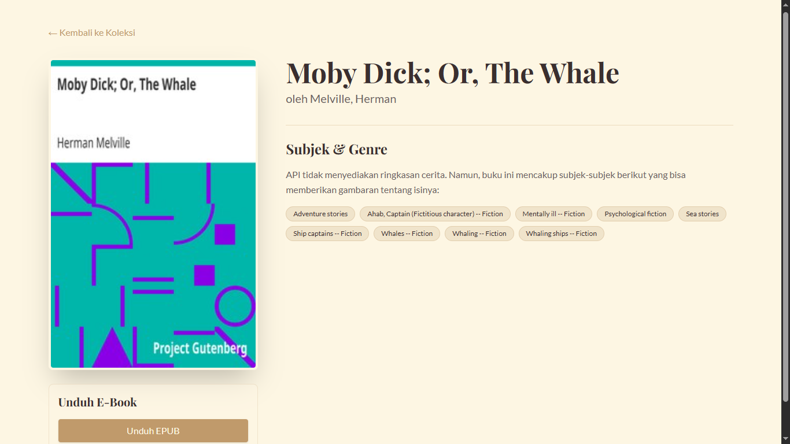

# Jendela Waktu .NET 📖

Selamat datang di Jendela Waktu .NET, sebuah perpustakaan digital mini yang didedikasikan untuk menjelajahi dunia novel-novel klasik dari Project Gutenberg. Proyek ini dibangun dengan React, Vite, dan Gutendex API.

#### Halaman Depan


#### Halaman Detail


## 📖 Tentang Proyek

**Jendela Waktu .NET** adalah sebuah aplikasi web yang dibangun menggunakan React dan Vite, berfungsi sebagai antarmuka yang indah dan modern untuk [Gutendex API](https://gutendex.com/). Aplikasi ini memungkinkan pengguna untuk mencari, memfilter, dan menemukan puluhan ribu buku klasik yang tersedia di domain publik. 

Proyek ini didesain dengan pendekatan "mobile-first" untuk memastikan pengalaman pengguna yang optimal di semua perangkat, mulai dari ponsel hingga desktop.

## ✨ Fitur-fitur

-   **Katalog Puluhan Ribu Buku:** Menampilkan lebih dari 70.000 novel klasik dari Gutendex API.
-   **Pencarian Interaktif:** Cari novel berdasarkan judul atau nama pengarang dengan mudah.
-   **Filter Berdasarkan Topik:** Jelajahi koleksi berdasarkan genre populer seperti Petualangan, Romansa, dan Fiksi Ilmiah.
-   **Paginasi Lengkap:** Navigasi yang nyaman antar ribuan halaman buku.
-   **Halaman Detail Komprehensif:** Lihat detail setiap buku, termasuk sampul, subjek, dan tautan unduhan e-book gratis.
-   **Tema Klasik & Elegan:** Desain yang terinspirasi dari buku-buku tua untuk kenyamanan membaca.
-   **Desain Responsif:** Tampilan yang rapi dan fungsional di perangkat desktop maupun mobile.

## 🛠️ Teknologi yang Digunakan

-   **Framework:** React (dengan Vite)
-   **Styling:** Tailwind CSS
-   **Data Fetching:** Native Fetch API
-   **Routing:** React Router DOM
-   **API:** [Gutendex API](https://gutendex.com/)

## 🚀 Instalasi & Menjalankan Proyek

Ingin menjalankan proyek ini di komputermu? Ikuti langkah-langkah berikut:

1.  **Clone repositori ini:**
    ```sh
    git clone https://github.com/ofikur/jendela-waktu-react.git
    ```

2.  **Masuk ke direktori proyek:**
    ```sh
    cd jendela-waktu-react
    ```

3.  **Install semua dependencies:**
    ```sh
    npm install
    ```

4.  **Jalankan development server:**
    ```sh
    npm run dev
    ```

Buka `http://localhost:5173` (atau port lain yang tertera di terminal) di browsermu dan mulailah menjelajahi waktu!